# 📚 도서 대여 시스템 - SQL 데이터베이스 실습

## 프로젝트 개요

도서관 도서 대여 서비스를 주제로 한 SQL 실습 프로젝트입니다.  
테이블 설계(스키마)부터 샘플 데이터 입력, 핵심 쿼리 15개 작성까지 전체 흐름을 실습합니다.

---

## 개발 환경

| 항목 | 내용 |
|------|------|
| DB | MySQL 8.0.46 |
| 접속 툴 | DBeaver 26.1.1 |
| OS | Windows |

---

## 파일 구성

```
📁 library_db/
├── 01_schema.sql        # 테이블 생성 스크립트 (CREATE TABLE, PK/FK/제약조건)
├── 02_sample_data.sql   # 샘플 데이터 INSERT 스크립트
├── 03_queries.sql       # 핵심 쿼리 15개
├── 04_bonus.sql         # 보너스 과제 (JOIN vs 서브쿼리, FK 에러, 미니 리포트)
└── README.md
```

---

## 테이블 구조 (ERD)

```
category (1) ──< book   (N)    카테고리 → 도서
member   (1) ──< rental (N)    회원     → 대여기록
book     (1) ──< rental (N)    도서     → 대여기록
member   (1) ──< review (N)    회원     → 리뷰
book     (1) ──< review (N)    도서     → 리뷰
```

### category (도서 카테고리)
| 컬럼 | 타입 | 제약조건 | 설명 |
|------|------|----------|------|
| category_id | INT | PK, AUTO_INCREMENT | 카테고리 ID |
| name | VARCHAR(50) | NOT NULL, UNIQUE | 카테고리명 |
| description | VARCHAR(200) | | 설명 |

### member (회원)
| 컬럼 | 타입 | 제약조건 | 설명 |
|------|------|----------|------|
| member_id | INT | PK, AUTO_INCREMENT | 회원 ID |
| name | VARCHAR(50) | NOT NULL | 이름 |
| email | VARCHAR(100) | NOT NULL, UNIQUE | 이메일 |
| phone | VARCHAR(20) | | 전화번호 |
| grade | VARCHAR(10) | NOT NULL, CHECK | 등급 (NORMAL/VIP) |
| joined_at | DATE | NOT NULL | 가입일 |

### book (도서)
| 컬럼 | 타입 | 제약조건 | 설명 |
|------|------|----------|------|
| book_id | INT | PK, AUTO_INCREMENT | 도서 ID |
| category_id | INT | FK → category | 카테고리 |
| title | VARCHAR(200) | NOT NULL | 제목 |
| author | VARCHAR(100) | NOT NULL | 저자 |
| publisher | VARCHAR(100) | | 출판사 |
| published_year | INT | | 출판연도 |
| total_copies | INT | NOT NULL, CHECK | 총 보유 권수 |
| available_copies | INT | NOT NULL, CHECK | 현재 대출 가능 권수 |

### rental (대여 기록)
| 컬럼 | 타입 | 제약조건 | 설명 |
|------|------|----------|------|
| rental_id | INT | PK, AUTO_INCREMENT | 대여 ID |
| member_id | INT | FK → member | 대여 회원 |
| book_id | INT | FK → book | 대여 도서 |
| rented_at | DATE | NOT NULL | 대여일 |
| due_date | DATE | NOT NULL | 반납 예정일 |
| returned_at | DATE | | 실제 반납일 (NULL = 미반납) |
| status | VARCHAR(10) | NOT NULL, CHECK | 상태 (RENTING/RETURNED/OVERDUE) |

### review (리뷰)
| 컬럼 | 타입 | 제약조건 | 설명 |
|------|------|----------|------|
| review_id | INT | PK, AUTO_INCREMENT | 리뷰 ID |
| member_id | INT | FK → member | 작성 회원 |
| book_id | INT | FK → book | 대상 도서 |
| rating | INT | NOT NULL, CHECK | 별점 (1~5) |
| content | TEXT | | 리뷰 내용 |
| created_at | DATETIME | NOT NULL | 작성일시 |

---

## 샘플 데이터 규모

| 테이블 | 행 수 |
|--------|-------|
| category | 10 |
| member | 12 |
| book | 15 |
| rental | 15 |
| review | 12 |

---

## 핵심 쿼리 15개 목록

| 번호 | 분류 | 설명 |
|------|------|------|
| Q01 | 기본 조회 | 현재 대출 중인 도서 목록 (WHERE + ORDER BY) |
| Q02 | 기본 조회 | VIP 회원 목록 (WHERE + ORDER BY) |
| Q03 | 기본 조회 | 소설 카테고리 도서 목록 (WHERE + ORDER BY) |
| Q04 | 기본 조회 | 별점 4점 이상 리뷰 TOP 5 (WHERE + ORDER BY + LIMIT) |
| Q05 | 조인 | 전체 대여 이력 조회 (INNER JOIN 3중) |
| Q06 | 조인 | 연체 회원 및 연체일수 (INNER JOIN + DATEDIFF) |
| Q07 | 조인 | 도서별 평균 별점, 리뷰 없는 도서 포함 (LEFT JOIN) |
| Q08 | 조인 | 회원별 총 대여횟수, 0회 포함 (LEFT JOIN) |
| Q09 | 집계 | 카테고리별 보유 도서 통계 (COUNT + SUM + AVG) |
| Q10 | 집계 | 월별 대여 건수 집계 (GROUP BY + DATE_FORMAT) |
| Q11 | 집계 | 리뷰 2개 이상 작성 회원의 평균 별점 (HAVING) |
| Q12 | 서브쿼리 | 전체 평균 별점보다 높은 도서 목록 |
| Q13 | 인덱스 | 인덱스 4개 생성 및 확인 |
| Q14 | 수정 | 연체 도서 반납 처리 (UPDATE) |
| Q15 | 삭제 | 저평점 리뷰 삭제 (DELETE) |

---

## 인덱스 설계

| 인덱스명 | 테이블 | 컬럼 | 생성 이유 |
|----------|--------|------|-----------|
| idx_rental_status | rental | status | 대여 상태별 조회(OVERDUE/RENTING 필터링)가 빈번함 |
| idx_rental_member | rental | member_id | 특정 회원의 대여 이력 조회 최적화 |
| idx_rental_book | rental | book_id | 도서별 대여 이력 조회 최적화 |
| idx_review_book | review | book_id | 도서별 평균 별점 집계 쿼리 최적화 |

---

## 실행 방법

> DBeaver 사용 시: 파일 열기 → 상단에서 localhost 연결 선택 → `Ctrl+A` → `Alt+X` (전체 실행)

---

### 쿼리 실행 결과


 Q01 | 기본 조회 | 현재 대출 중인 도서 목록 (WHERE + ORDER BY)
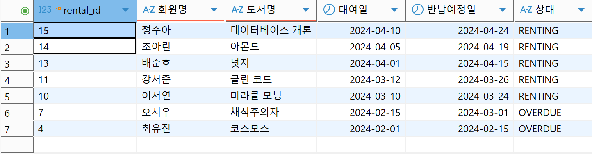


 Q02 | 기본 조회 | VIP 회원 목록 (WHERE + ORDER BY) |
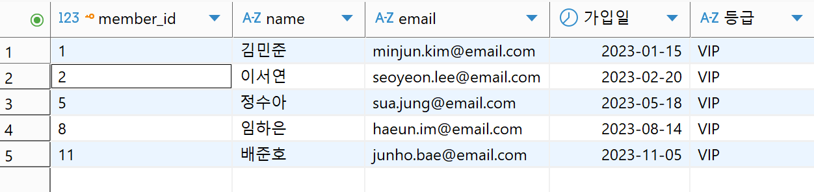

 Q03 | 기본 조회 | 소설 카테고리 도서 목록 (WHERE + ORDER BY) |
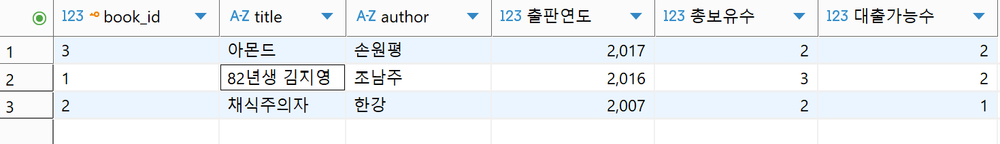

 Q04 | 기본 조회 | 별점 4점 이상 리뷰 TOP 5 (WHERE + ORDER BY + LIMIT) |
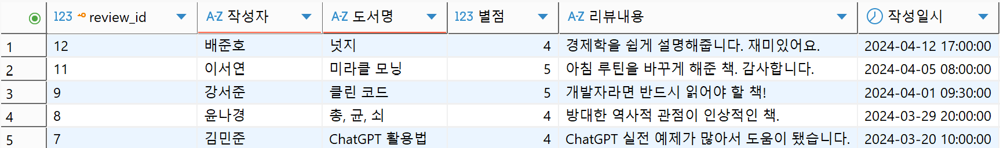

 Q05 | 조인 | 전체 대여 이력 조회 (INNER JOIN 3중) |
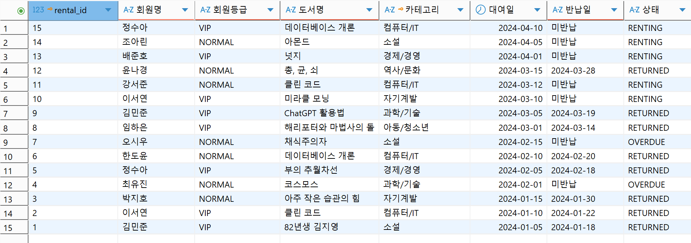

 Q06 | 조인 | 연체 회원 및 연체일수 (INNER JOIN + DATEDIFF) |
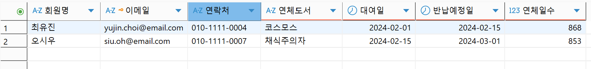

 Q07 | 조인 | 도서별 평균 별점, 리뷰 없는 도서 포함 (LEFT JOIN) |
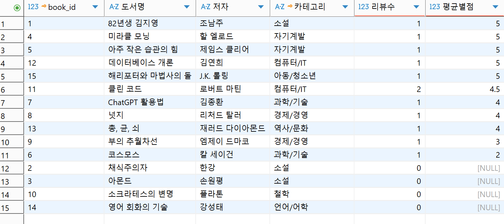

 Q08 | 조인 | 회원별 총 대여횟수, 0회 포함 (LEFT JOIN) |
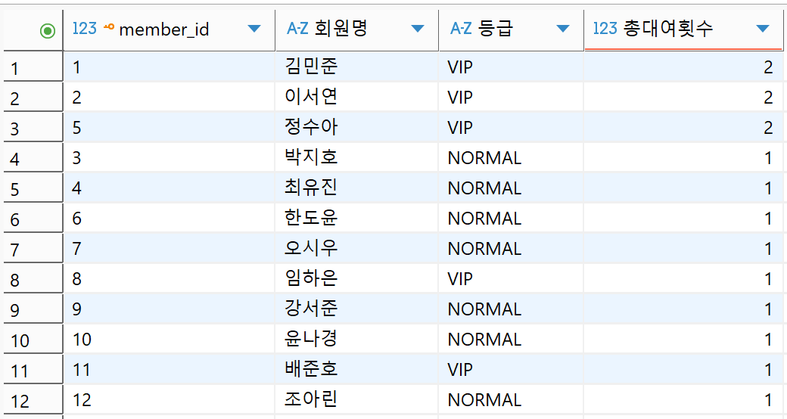

 Q09 | 집계 | 카테고리별 보유 도서 통계 (COUNT + SUM + AVG) |
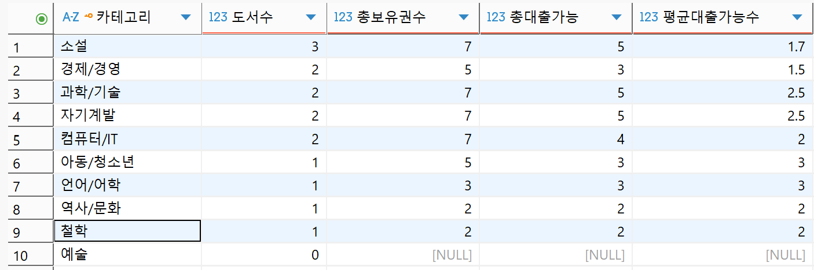

 Q10 | 집계 | 월별 대여 건수 집계 (GROUP BY + DATE_FORMAT) |
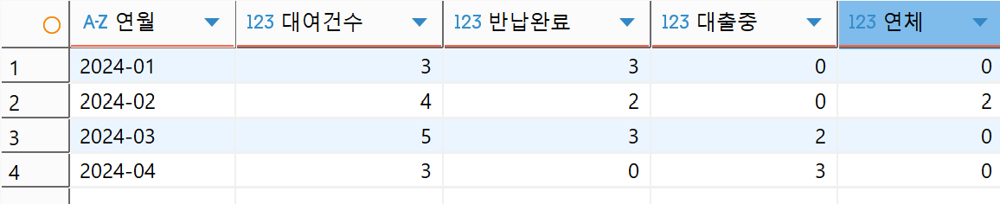

 Q11 | 집계 | 리뷰 2개 이상 작성 회원의 평균 별점 (HAVING) |
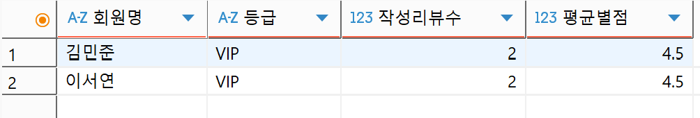

 Q12 | 서브쿼리 | 전체 평균 별점보다 높은 도서 목록 |
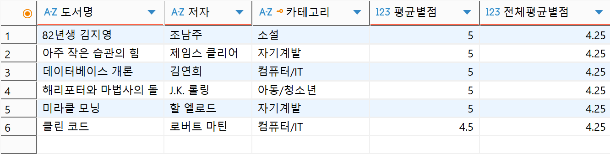

 Q13 | 인덱스 | 인덱스 4개 생성 및 확인 |
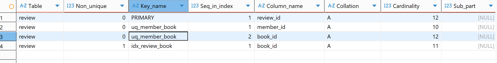

 Q14 | 수정 | 연체 도서 반납 처리 (UPDATE) |

반납 처리 전 상태 확인
 ```
rental_id|회원명|도서명 |상태     |반납일|현재대출가능수|
---------+---+----+-------+---+-------+
        4|최유진|코스모스|OVERDUE|   |      1|
```

반납 상태로 업데이트
```
rental_id|회원명|도서명 |상태      |반납일       |현재대출가능수|
---------+---+----+--------+----------+-------+
        4|최유진|코스모스|RETURNED|2024-04-15|      2|
```
 Q15 | 삭제 | 저평점 리뷰 삭제 (DELETE) |

삭제 전
```
review_id|작성자|도서명 |별점|리뷰내용                   |
---------+---+----+--+-----------------------+
       10|최유진|코스모스| 2|생각보다 어려웠습니다. 중급자 이상 추천.|
```

삭제 후
```
review_id|작성자|도서명|별점|
---------+---+---+--+
```

---

## 보너스 과제

### 1. JOIN vs 서브쿼리 비교
- 요구사항: "리뷰를 한 번이라도 작성한 회원 조회"
- INNER JOIN 방식과 서브쿼리(IN) 방식으로 각각 구현 후 차이 비교

| 항목         | JOIN 방식               | 서브쿼리 방식              |
|--------------|-------------------------|----------------------------|
| 읽기 편의성  | 관계가 명확하게 보임    | 조건 의도가 더 직관적      |
| 성능         | 대용량에서 보통 더 빠름 | IN 목록 커지면 느려질 수 있음 |
| 중복 처리    | DISTINCT 필요           | 자동으로 중복 없음         |
| 활용 상황    | 조인 컬럼도 SELECT할 때 | "~에 해당하는 것만" 필터할 때 |

결론: 결과는 동일하지만, JOIN은 여러 테이블 컬럼을 함께 볼 때 유리하고
      서브쿼리는 "조건 필터" 의도를 명확하게 표현할 때 유리하다.

### 2. FK 에러 실험
의도적으로 FK 제약조건을 위반해 에러를 발생시키고 원인과 해결 방법을 기록

- **케이스 A:** 존재하지 않는 member_id(999)로 rental INSERT 시도
- **케이스 B:** 존재하지 않는 book_id(999)로 rental INSERT 시도
- **케이스 C:** 자식 테이블이 참조 중인 부모 행 삭제 시도

> FK는 "참조 무결성"을 보장한다. 자식 테이블은 부모에 존재하는 값만 참조할 수 있고,
> 부모 행은 자식이 참조 중이면 삭제할 수 없다. 이런걸 '고아 데이터'라고 하며 고아데이터가 생기는걸 엑셀과 달리 DB가 자동으로 막아준다.

### 3. 미니 리포트 - 핵심 지표 3개
| 지표 | 설명 |
|------|------|
| 월별 대여 건수 추이 | 월별 대여/반납/연체 건수와 반납완료율 |
| 인기 도서 TOP 5 | 대여횟수 + 평균별점을 함께 집계 |
| 연체 회원 목록 | 연체횟수, 연체율, 마지막 연체일 포함 |

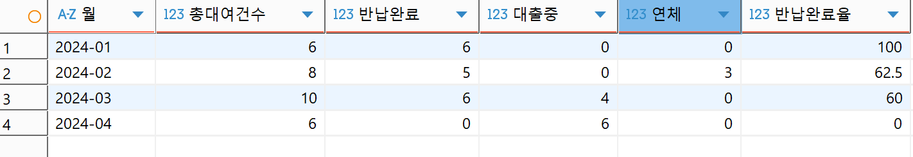
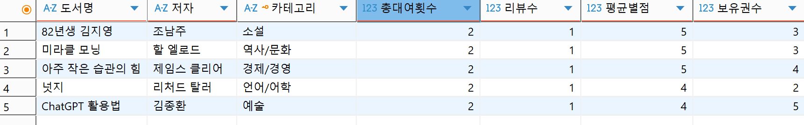
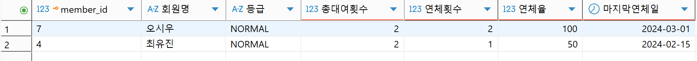

---

## 학습 포인트

- **DB vs 엑셀:** 테이블 간 관계(FK)로 데이터 무결성을 자동으로 보장한다
- **PK/FK:** PK는 각 행의 고유 식별자, FK는 다른 테이블의 PK를 참조해 관계를 맺는다
- **1:N 관계:** 하나의 회원이 여러 대여 기록을 가질 수 있는 구조
- **JOIN:** 분리된 테이블을 연결해 필요한 정보를 한 번에 조회
- **GROUP BY:** 집계 함수(COUNT, SUM, AVG)와 함께 그룹별 통계를 낸다
- **인덱스:** 자주 조회하는 컬럼에 적용해 검색 속도를 높인다
